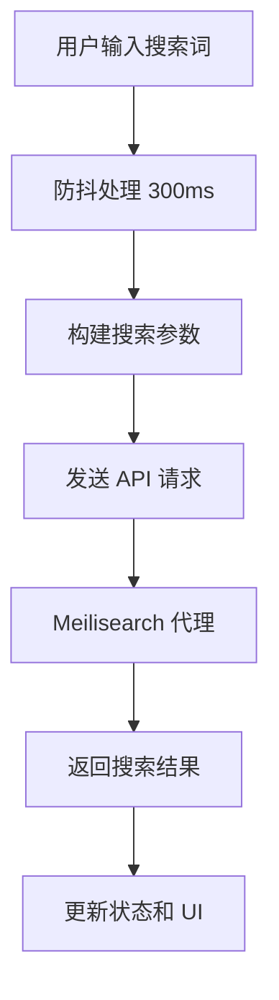
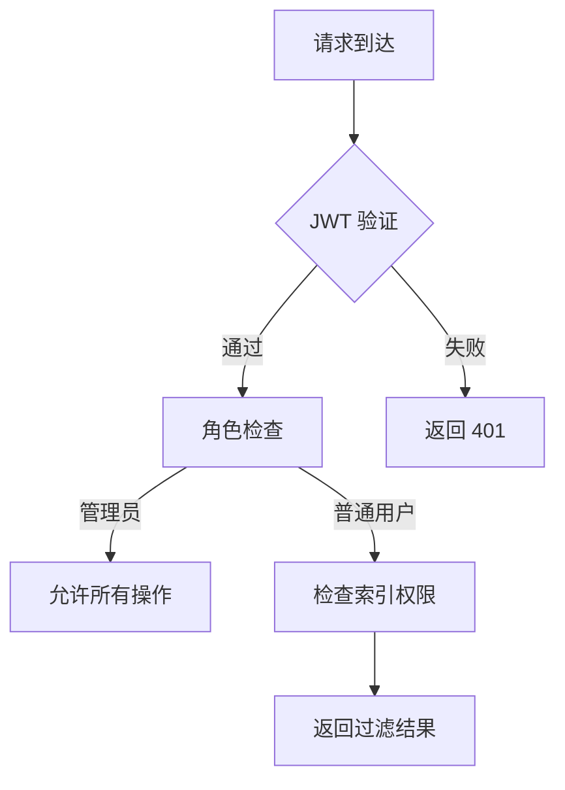
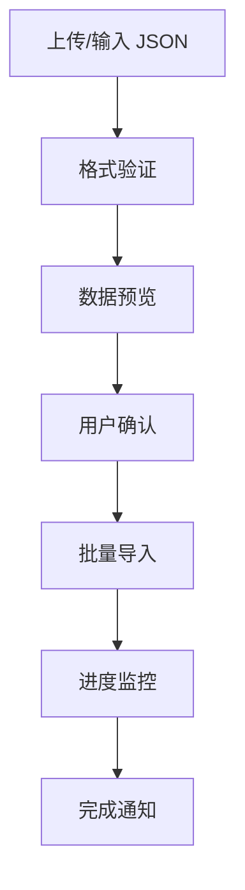

# Meilisearch UI 系统分析与开发指南

## 📋 项目概述

Meilisearch UI 是一个功能完整的搜索管理界面系统，包含前端 Vue 3 应用和后端 Go 服务，为 Meilisearch 搜索引擎提供企业级的管理和搜索界面。

---

## 🏗️ 系统架构

### 前端架构 (Vue 3 + TypeScript)
```
src/
├── components/          # Vue 组件
│   ├── AdminPanel.vue   # 管理面板
│   ├── AssetManagement.vue # 资产管理
│   ├── ConnectionPanel.vue # 连接面板
│   ├── FilterDrawer.vue # 筛选面板
│   ├── LoadingOverlay.vue # 加载遮罩
│   ├── Modals.vue       # 模态框组件
│   ├── NestedDataDrawer.vue # 嵌套数据查看器
│   ├── ResultsTable.vue # 结果表格
│   ├── SearchSection.vue # 搜索区域
│   └── ToastContainer.vue # 提示容器
├── composables/         # Vue 组合式函数
│   ├── useApp.ts        # 主应用状态管理
│   ├── useSearchStore.ts # 搜索状态
│   ├── useAssetStore.ts # 资产状态
│   └── useUIStore.ts    # UI 状态
├── services/            # API 服务
│   ├── api.ts           # API 接口封装
│   └── storage.ts       # 本地存储服务
├── router/              # 路由配置
│   └── index.ts         # 路由定义
├── views/               # 页面组件
│   ├── Login.vue        # 登录页面
│   └── SearchMain.vue   # 主搜索页面
└── types/               # TypeScript 类型定义
```

### 后端架构 (Go + Gin)
```
backend/
├── api/                 # API 路由和处理器
│   ├── router.go        # 路由配置
│   ├── auth.go          # 认证相关
│   ├── proxy.go         # Meilisearch 代理
│   ├── admin.go         # 管理接口
│   └── application.go   # 应用相关
├── model/               # 数据模型
│   └── models.go        # GORM 模型定义
├── repository/          # 数据访问层
│   └── db.go            # 数据库初始化
└── schema/              # 数据传输对象
    └── dto.go           # DTO 定义
```

---

## 🔧 核心功能实现

### 1. 🔍 搜索功能
- **即时搜索**: 基于 Meilisearch 的高性能搜索，300ms 防抖优化
- **多条件查询**: 支持字段、操作符、值组合的复杂查询构建器
- **AI 增强搜索**: 支持语义搜索权重调节（0-100%）
- **排序和分页**: 支持多字段排序和自定义分页

**核心代码**:
- 前端: `src/composables/useApp.ts` - `performSearch()`, `buildSearchParams()`
- 后端: `backend/api/proxy.go` - 代理转发 Meilisearch 请求

### 2. 📊 数据展示
- **嵌套数据查看器**: 无限层级 JSON 数据可视化
- **自定义列显示**: 拖拽调整列顺序，配置显示/隐藏
- **视图模式**: 支持表格和自定义视图布局
- **实时数据编辑**: 支持行内编辑和批量保存

**核心代码**:
- 前端: `src/components/NestedDataDrawer.vue`, `src/components/ResultsTable.vue`
- 状态: `src/composables/useApp.ts` - `lastHits`, `visibleColumns`

### 3. 🛠️ 索引管理
- **索引配置**: 管理搜索、过滤、排序字段
- **权重调整**: 拖拽式排序规则配置
- **索引生命周期**: 创建、重命名、清空、删除
- **设置同步**: 自动同步配置到 Meilisearch

**核心代码**:
- 前端: `src/composables/useApp.ts` - `saveFieldConfig()`, `createIndex()`
- 后端: `backend/api/admin.go` - `HandleSaveIndexConfig()`, `HandleDeleteIndex()`

### 4. 📦 数据导入导出
- **JSON 导入**: 支持文件和文本两种方式
- **实时预览**: 导入前预览解析结果
- **CSV 导出**: 大数据量分批导出
- **进度监控**: 可视化导入/导出进度

**核心代码**:
- 前端: `src/composables/useApp.ts` - `batchImport()`, `exportCsv()`
- API: `src/services/api.ts` - `batchImportDocuments()`, `exportAllCsv()`

### 5. 🔐 安全系统
- **JWT 认证**: 管理员登录和权限控制
- **Token 系统**: 访问令牌申请和审批
- **代理网关**: 隐藏真实 Meilisearch 地址和密钥
- **访问控制**: 索引级别的可见性和锁定控制

**核心代码**:
- 后端: `backend/api/auth.go` - JWT 认证中间件
- 代理: `backend/api/proxy.go` - 安全代理层
- Token: `backend/api/admin.go` - Token 管理

### 6. 👥 多租户支持
- **索引隔离**: 基于配置的访问控制
- **权限系统**: 管理员和普通用户角色
- **应用管理**: 多应用配置和访问控制
- **使用统计**: 按索引和使用量统计

---

## 🔄 数据流和状态管理

### 前端状态管理 (Pinia)
```typescript
// 核心状态结构
interface AppState {
  // 连接信息
  hostInput: string
  apiKeyInput: string
  indexes: IndexInfo[]
  currentIndex: string
  
  // 搜索状态
  searchInput: string
  queryRows: QueryRow[]
  lastHits: SearchHit[]
  
  // UI 状态
  currentTab: 'search' | 'assets' | 'admin'
  loading: boolean
  toasts: Toast[]
  
  // 配置
  fieldLabels: Record<string, string>
  columnOrder: string[]
  hiddenColumns: string[]
}
```

### 后端数据模型 (GORM)
```go
// 核心模型
type User struct {          // 管理员
  ID       uint
  Username string
  Role     string
}

type IndexConfig struct {   // 索引配置
  ID          uint
  Uid         string      // 索引 UID
  Alias       string      // 别名
  IsVisible   bool        // 是否可见
  IsLocked    bool        // 是否锁定
  FieldConfigs string     // JSON 字段配置
}

type AccessToken struct {   // 访问令牌
  ID          uint
  Token       string
  AllowIndexes string     // JSON 允许访问的索引
  ExpiresAt   *time.Time
}

type Application struct {   // 应用配置
  ID        uint
  Name      string
  AppKey    string        // 应用密钥
  UIConfig  string        // JSON UI 配置
}
```

---

## 🚀 下一步开发方向

### 高优先级功能
1. **配额管理系统**
   - 实时监控查询量、导入量、存储空间
   - 基于套餐的自动限流机制
   - 用量预警和通知

2. **商业化仪表盘**
   - 租户用量统计和可视化
   - 收入分析和账单预览
   - 套餐管理和升级流程

3. **高级权限系统**
   - 细粒度的字段级权限控制
   - 多角色支持（管理员、编辑者、查看者）
   - 操作日志和审计

### 中优先级功能
4. **AI 增强功能**
   - 集成向量检索
   - 自动生成搜索建议
   - 智能查询优化

5. **多格式数据支持**
   - CSV、Excel 导入
   - Parquet 格式支持
   - 数据库直连同步

6. **性能优化**
   - 查询结果缓存
   - 批量操作优化
   - 前端虚拟滚动优化

### 低优先级功能
7. **协作功能**
   - 搜索结果分享
   - 团队协作空间
   - 注释和标记系统

8. **高级分析**
   - 搜索热力图
   - 用户行为分析
   - A/B 测试支持

9. **DevOps 增强**
   - 容器化部署优化
   - 监控和告警集成
   - 自动备份和恢复

---

## 📝 开发规范

### 前端开发
- 使用 Composition API 和 TypeScript
- 状态管理使用 Pinia
- 组件按功能划分，保持单一职责
- API 调用统一使用 services 层

### 后端开发
- 使用 Gin 框架和 GORM
- 分层架构：Handler -> Service -> Repository
- 统一的错误处理和日志记录
- 完善的单元测试

### 数据库
- 使用 SQLite/MySQL
- 版本化迁移脚本
- 索引优化和查询优化
- 定期备份策略

---

## 🔍 核心实现逻辑

### 1. 搜索流程


### 2. 权限验证流程


### 3. 数据导入流程


---

## 🎯 性能优化建议

1. **前端优化**
   - 实现虚拟滚动处理大量数据
   - 添加查询结果缓存层
   - 优化组件渲染性能
   - 使用懒加载和代码分割

2. **后端优化**
   - 添加 Redis 缓存层
   - 实现连接池管理
   - 优化数据库查询
   - 添加限流中间件

3. **基础设施**
   - 添加 CDN 加速静态资源
   - 实现负载均衡
   - 数据库主从复制
   - 监控和自动扩缩容

---

## 📚 技术栈总结

### 前端
- Vue 3 + Composition API
- TypeScript 类型安全
- Pinia 状态管理
- Vue Router 路由
- Axios HTTP 客户端
- Vite 构建工具

### 后端
- Go 1.21+
- Gin Web 框架
- GORM ORM
- JWT 认证
- SQLite/MySQL
- Meilisearch Go SDK

### 部署
- Docker 容器化
- Docker Compose 编排
- Nginx 反向代理
- Let's Encrypt SSL

---

## 🤝 贡献指南

1. Fork 项目并创建功能分支
2. 遵循现有的代码风格和架构
3. 添加必要的单元测试
4. 更新相关文档
5. 提交 Pull Request

## 📄 许可证

MIT License - 详见 LICENSE 文件

---

**项目状态**: 活跃开发中 🚀
**最后更新**: 2026-05-15